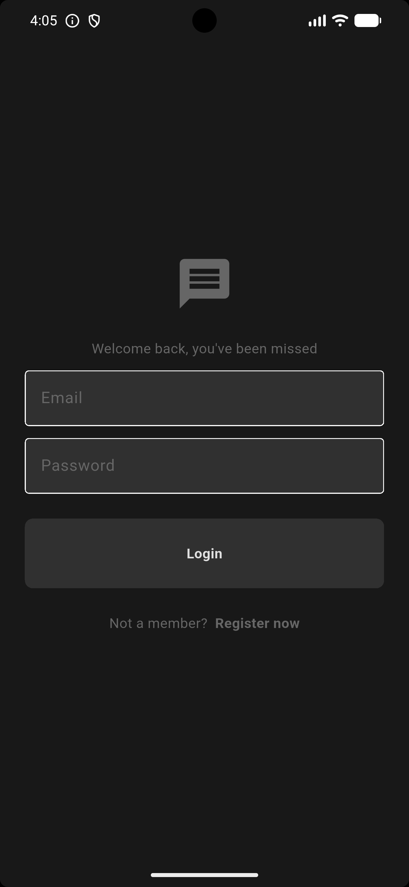
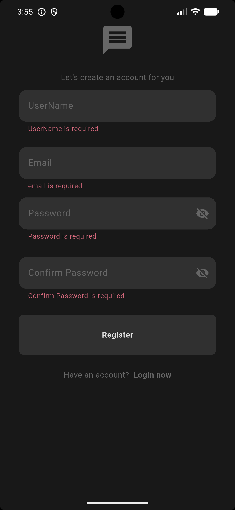
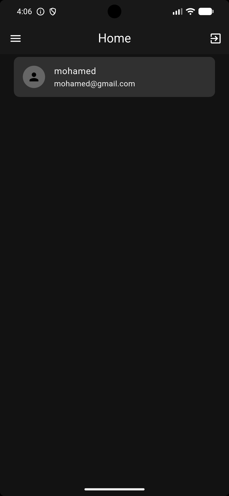
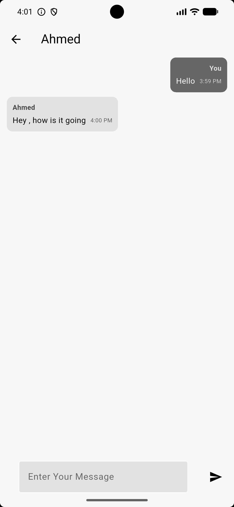
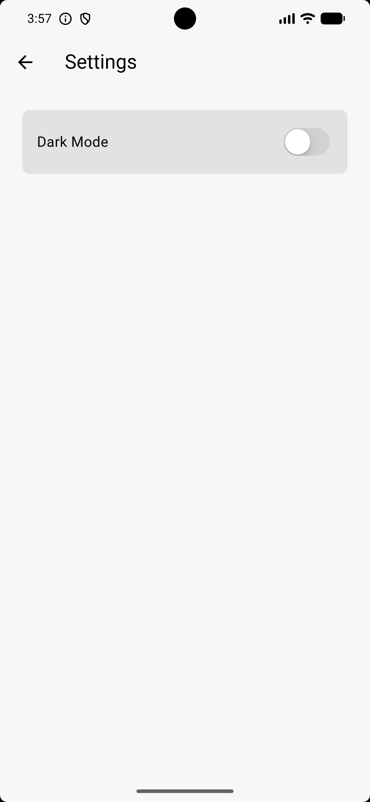
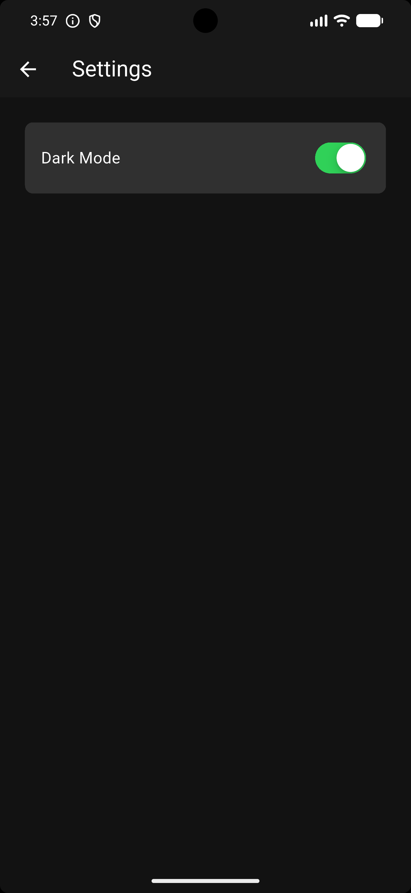

# 💬 Flutter Firebase Chat App

A real-time chat application built with Flutter and Firebase. This project is based on a [YouTube tutorial](https://www.youtube.com/watch?v=5xU5WH2kEc0), but significantly extended with **Clean Architecture**, **BLoC/Cubit** state management, **Dependency Injection**, **dynamic theming**, and several UX improvements not present in the original tutorial.

---

## 📸 Screenshots

> 🖼️ _Screenshots coming soon — drop your actual app screenshots into `docs/screenshots/` to replace the placeholders below._

| Login | Register | Home |
|:-----:|:--------:|:----:|
|  |  |  |

| Chat | Settings (Light) | Settings (Dark) |
|:----:|:----------------:|:---------------:|
|  |  |  |

> 💡 **To add screenshots:** place your `.png` files inside the `docs/screenshots/` folder.

---

## ✨ Features

- 🔐 **Authentication** — Register and log in with email & password via Firebase Auth
- 💬 **Real-time Messaging** — Send and receive messages instantly using Firestore streams
- ✍️ **Typing Indicator** — Live "typing..." indicator shown when the other user is actively typing
- 🕐 **Formatted Timestamps** — Message timestamps displayed in a clean `h:mm a` format (e.g. `2:30 PM`) using the `intl` package
- 👥 **User List** — Browse all registered users (excluding the currently logged-in user)
- 🚪 **Auth Gate** — Automatically routes users to login or home based on their authentication state
- 🌙 **Dark / Light Mode** — Fully dynamic theming switchable at runtime from the Settings page
- 💾 **Persistent Theme** — Selected theme (light/dark) is saved locally with `SharedPreferences` and restored on next launch
- 🎨 **Theme-consistent Coloring** — All UI colors sourced from `ThemeData`'s `ColorScheme` — no hardcoded colors
- 📜 **Auto-scroll** — Chat list automatically scrolls to the latest message on open and after sending
- ⌨️ **Keyboard-aware Scroll** — Chat view scrolls down when the keyboard appears (focus gained)
- ✅ **Password Validation UI** — Live per-requirement feedback during registration (length, uppercase, digits, special chars)

---

## 🏗️ Architecture

This project follows a **layered clean architecture** approach, which was added on top of the original tutorial's structure:

```
UI Layer (Pages)
      ↓
Logic Layer (Cubit / BLoC)
      ↓
Repository Layer (abstracts data sources)
      ↓
Service Layer (Firebase communication)
```

Each feature is self-contained under `lib/features/`, with its own `cubit/` and `repository/` directories.

---

## 🎨 Theming

The app supports **dynamic Light and Dark themes**, toggled from the **Settings** page via a `CupertinoSwitch`. Theme state is managed by `ThemeCubit` and persisted at the app root level.

> 💾 **Theme Persistence** — The user's theme choice is saved to local storage using `SharedPreferences` (via the [`shared_preferences`](https://pub.dev/packages/shared_preferences) package). On the next app launch, `ThemeCubit` reads the saved preference and restores the correct theme before the first frame renders.

### Color Palette

Both themes are defined in `lib/core/theme/` and use Flutter's `ColorScheme`:

| Role | Light Mode | Dark Mode |
|------|-----------|-----------|
| `surface` | `Colors.grey.shade300` | `Colors.grey.shade900` |
| `primary` | `Colors.grey.shade500` | `Colors.grey.shade600` |
| `secondary` | `Colors.grey.shade200` | `Colors.grey.shade700` |
| `tertiary` | `Colors.white` | `Colors.white` |
| `inversePrimary` | `Colors.grey.shade900` | `Colors.grey.shade300` |

### How colors are used in the app

Every widget reads colors exclusively from `Theme.of(context).colorScheme` — **no hardcoded `Colors.*` values** appear anywhere in the UI layer:

| Widget / File | Color Token Used |
|---|---|
| `AppTextField` | `secondary` (fill), `primary` (hint, border, icon), `tertiary` (enabled border) |
| `AppButton` | `secondary` (background), `inversePrimary` (text) |
| `AppDrawer` | `surface` (background), `primary` (icon) |
| `ChatPage` — my bubble text | `onPrimary` / `onPrimary.withValues(alpha: 0.7)` |
| `ChatPage` — other bubble text | `onSecondary` / `onSecondary.withValues(alpha: 0.6–0.7)` |
| `ChatPage` — bubble background | `primary` (me) / `secondary` (other) |
| `LoginPage` / `RegisterPage` | `surface` (background), `primary` (icon, text) |
| `HomePage` | `secondary` (user card background) |
| `SettingsPage` | `secondary` (card background) |
| `PasswordRequirement` | `tertiary` (valid ✅), `primary` (invalid ⭕) |

---

## 🛠️ Tech Stack

| Technology | Purpose |
|---|---|
| [Flutter](https://flutter.dev) | UI framework |
| [Firebase Auth](https://firebase.google.com/products/auth) | User authentication |
| [Cloud Firestore](https://firebase.google.com/products/firestore) | Real-time database |
| [flutter_bloc](https://pub.dev/packages/flutter_bloc) | State management (Cubit) |
| [get_it](https://pub.dev/packages/get_it) | Dependency injection |
| [intl](https://pub.dev/packages/intl) | Date/time formatting |
| [equatable](https://pub.dev/packages/equatable) | Value equality for states |
| [shared_preferences](https://pub.dev/packages/shared_preferences) | Persist theme preference locally |

---

## 📁 Project Structure

```
lib/
├── core/
│   ├── di/               # Dependency injection setup (GetIt)
│   ├── models/           # Shared data models (UserModel, Message)
│   ├── services/
│   │   ├── auth/         # Firebase Auth service
│   │   └── chat/         # Firestore chat & typing service
│   ├── theme/
│   │   ├── cubit/        # ThemeCubit — toggles light/dark at runtime
│   │   ├── dark_mode.dart
│   │   └── light_mode.dart
│   ├── utils/            # Validators, shared utilities
│   └── widgets/          # Reusable widgets (AppTextField, AppButton, AppDrawer)
│
├── features/
│   ├── auth/             # Auth gate, cubit, repository
│   ├── login/            # Login page & cubit
│   ├── register/         # Register page & cubit (+ PasswordRequirement widget)
│   ├── home/             # User list page, cubit, repository
│   ├── chat/             # Chat page (StatefulWidget), cubit, repository
│   └── settings/         # Settings page — dark/light toggle
│
├── firebase_options.dart
└── main.dart
```

---

## 🚀 Getting Started

### Prerequisites

- Flutter SDK `^3.12.2`
- A Firebase project with **Authentication** (email/password) and **Firestore** enabled

### Setup

1. **Clone the repository:**
   ```bash
   git clone <your-repo-url>
   cd chat_app
   ```

2. **Install dependencies:**
   ```bash
   flutter pub get
   ```

3. **Configure Firebase:**
   - Create a Firebase project at [console.firebase.google.com](https://console.firebase.google.com)
   - Enable **Email/Password** sign-in under Authentication
   - Create a **Firestore** database
   - Run the FlutterFire CLI to generate `firebase_options.dart`:
     ```bash
     dart pub global activate flutterfire_cli
     flutterfire configure
     ```

4. **Run the app:**
   ```bash
   flutter run
   ```

---

## 🔥 Firestore Data Structure

```
Users/
  {uid}/
    uid: string
    email: string
    userName: string

chat_rooms/
  {uid1_uid2}/           # Sorted & joined user UIDs
    typing_{uid}: bool   # Per-user typing status
    messages/
      {messageId}/
        senderID: string
        senderEmail: string
        receiverID: string
        message: string
        createdAt: timestamp
```

---

## 🎓 Original Tutorial

This app was inspired by the following tutorial:

> **Flutter Chat App Tutorial** — [Watch on YouTube](https://www.youtube.com/watch?v=5xU5WH2kEc0)

### What was added beyond the tutorial

| Feature | Tutorial | This Project |
|---|---|---|
| State Management | ❌ (setState / streams) | ✅ BLoC / Cubit |
| Clean Architecture | ❌ | ✅ Service → Repository → Cubit → UI |
| Dependency Injection | ❌ | ✅ GetIt |
| Typing Indicator | ❌ | ✅ Real-time Firestore streams |
| Formatted Timestamps | ❌ | ✅ `intl` package (`h:mm a`) |
| Password Validation Cubit | ❌ | ✅ Live per-requirement feedback |
| Dark / Light Theme | ❌ | ✅ `ThemeCubit` + `CupertinoSwitch` in Settings |
| Persistent Theme (SharedPreferences) | ❌ | ✅ Theme saved locally & restored on next launch |
| Theme-consistent Colors | ❌ | ✅ All UI colors from `ColorScheme` — zero hardcoded `Colors.*` |
| Auto-scroll to latest message | ❌ | ✅ On open & after send |
| Keyboard-aware scroll | ❌ | ✅ Scrolls down when keyboard appears |
| Chat page as `StatefulWidget` | ❌ | ✅ Proper lifecycle (`ScrollController`, `FocusNode`, `dispose`) |

---

## 📄 License

This project is for educational purposes. Feel free to use and extend it.


---

## ✨ Features

- 🔐 **Authentication** — Register and log in with email & password via Firebase Auth
- 💬 **Real-time Messaging** — Send and receive messages instantly using Firestore streams
- ✍️ **Typing Indicator** — Live "typing..." indicator shown when the other user is actively typing
- 🕐 **Formatted Timestamps** — Message timestamps displayed in a clean `h:mm a` format (e.g. `2:30 PM`) using the `intl` package
- 👥 **User List** — Browse all registered users (excluding the currently logged-in user)
- 🚪 **Auth Gate** — Automatically routes users to login or home based on their authentication state

---

## 🏗️ Architecture

This project follows a **layered clean architecture** approach, which was added on top of the original tutorial's structure:

```
UI Layer (Pages)
      ↓
Logic Layer (Cubit / BLoC)
      ↓
Repository Layer (abstracts data sources)
      ↓
Service Layer (Firebase communication)
```

Each feature is self-contained under `lib/features/`, with its own `cubit/` and `repository/` directories.

---

## 🛠️ Tech Stack

| Technology | Purpose |
|---|---|
| [Flutter](https://flutter.dev) | UI framework |
| [Firebase Auth](https://firebase.google.com/products/auth) | User authentication |
| [Cloud Firestore](https://firebase.google.com/products/firestore) | Real-time database |
| [flutter_bloc](https://pub.dev/packages/flutter_bloc) | State management (Cubit) |
| [get_it](https://pub.dev/packages/get_it) | Dependency injection |
| [intl](https://pub.dev/packages/intl) | Date/time formatting |
| [equatable](https://pub.dev/packages/equatable) | Value equality for states |
| [shared_preferences](https://pub.dev/packages/shared_preferences) | Persist theme preference locally |

---

## 📁 Project Structure

```
lib/
├── core/
│   ├── di/               # Dependency injection setup (GetIt)
│   ├── models/           # Shared data models (UserModel, Message)
│   ├── services/
│   │   ├── auth/         # Firebase Auth service
│   │   └── chat/         # Firestore chat & typing service
│   ├── theme/            # App theme (light mode)
│   ├── utils/            # Validators, shared utilities
│   └── widgets/          # Reusable widgets (e.g. AppTextField)
│
├── features/
│   ├── auth/             # Auth gate, cubit, repository
│   ├── login/            # Login page & cubit
│   ├── register/         # Register page & cubit
│   ├── home/             # User list page, cubit, repository
│   ├── chat/             # Chat page, cubit, repository
│   └── settings/         # Settings page
│
├── firebase_options.dart
└── main.dart
```

---

## 🚀 Getting Started

### Prerequisites

- Flutter SDK `^3.12.2`
- A Firebase project with **Authentication** (email/password) and **Firestore** enabled

### Setup

1. **Clone the repository:**
   ```bash
   git clone <your-repo-url>
   cd chat_app
   ```

2. **Install dependencies:**
   ```bash
   flutter pub get
   ```

3. **Configure Firebase:**
   - Create a Firebase project at [console.firebase.google.com](https://console.firebase.google.com)
   - Enable **Email/Password** sign-in under Authentication
   - Create a **Firestore** database
   - Run the FlutterFire CLI to generate `firebase_options.dart`:
     ```bash
     dart pub global activate flutterfire_cli
     flutterfire configure
     ```

4. **Run the app:**
   ```bash
   flutter run
   ```

---

## 🔥 Firestore Data Structure

```
Users/
  {uid}/
    uid: string
    email: string
    userName: string

chat_rooms/
  {uid1_uid2}/           # Sorted & joined user UIDs
    typing_{uid}: bool   # Per-user typing status
    messages/
      {messageId}/
        senderID: string
        senderEmail: string
        receiverID: string
        message: string
        createdAt: timestamp
```

---

## 🎓 Original Tutorial

This app was inspired by the following tutorial:

> **Flutter Chat App Tutorial** — [Watch on YouTube](https://www.youtube.com/watch?v=5xU5WH2kEc0)

### What was added beyond the tutorial

| Feature | Tutorial | This Project |
|---|---|---|
| State Management | ❌ (setState / streams) | ✅ BLoC / Cubit |
| Clean Architecture | ❌ | ✅ Service → Repository → Cubit → UI |
| Dependency Injection | ❌ | ✅ GetIt |
| Typing Indicator | ❌ | ✅ Real-time Firestore streams |
| Formatted Timestamps | ❌ | ✅ `intl` package (`h:mm a`) |
| Password Validation Cubit | ❌ | ✅ Live per-requirement feedback |
| Persistent Theme (SharedPreferences) | ❌ | ✅ Theme saved locally & restored on next launch |

---

## 📄 License

This project is for educational purposes. Feel free to use and extend it.
